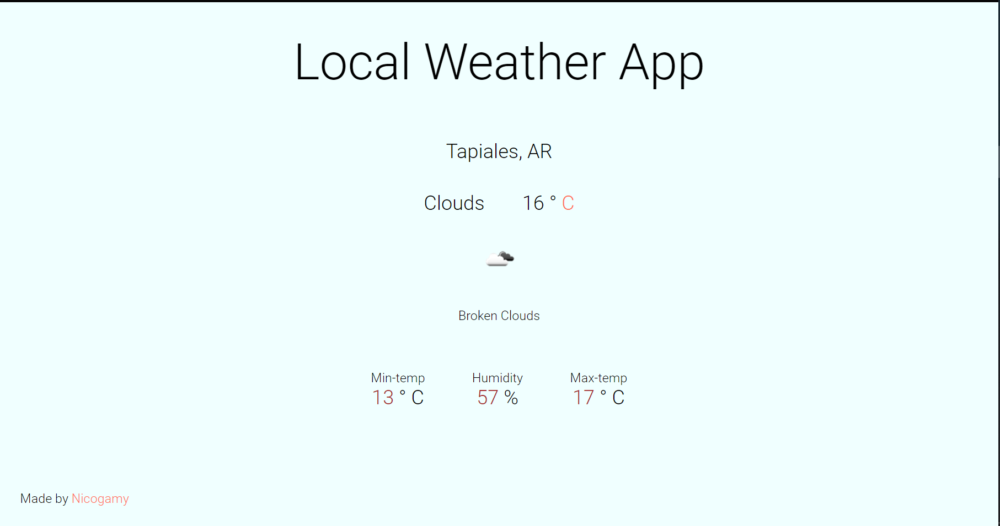

# **Basic Weather App**
## **showing local weather with an API and AJAX**
### [You can see the project here](https://necogamy.github.io/local_weather_API_ajax/)

## **Overview**

## **Features**
* You can see your local weather in celsius and fahrenheit
* Full responsive

## **Built with**
* HTML5 & CSS3 | Mobile first
* JavaScript - ECMAScript | Promises, AJAX (asynchronous javascript and xml)
* API from https://weather-proxy.freecodecamp.rocks/
* geolocation web-included api

## **Other tools used**
* Git
* GitHub
* wireframe.cc for wireframe
* Visual Studio Code & Bash Terminal